# Customer Data Cleaning and Purchase Analysis Dashboard

## Project Overview 
This project is a customer analytics project that includes data cleaning, purchase analysis, and dashboard visualization using Excel. The goal is to analyze customer purchase behavior and extract meaningful insights.

---

## Project Objectives
- Clean and preprocess raw customer data  
- Analyze customer data by country and total amount spent.
- Calculate KPIs 
- Create dashboard visualizations  

---

## Tools Used
- Excel
- Excel Ribbon Tools
- Excel Formulas & Functions
- Tables
- Charts
- Data Formatting

---

## Dataset Information
- **Source:** The data set used in this project was generated using DeepSeek AI(a generative artificial intelligence platform)  for portfolio purpose. All data is synthetic and does not represent real individuals.
- The raw data set has 183 rows including header row, duplicates rows and blank rows and the following six columns
Customer_ID

Customer_Name

Email

Country

Last_Purchase_Date

Total_Spent($)
- Type: Customer purchase records  

---

## Privacy Notice
- Due to privacy considerations,the complete Excel dataset is not publicly shared. Selected sample screenshots from raw dataset and supporting table are provided to demonstrate the cleaning and analysis workflow

## Data Cleaning 
This project focuses on cleaning and preparing raw data set using Excel.The raw dataset contained several inconsistencies and missing values, including:
- Extra spaces and inconsistent casing in Customer_Name
- Formatting errors, invalid characters, and missing values in Email
- Capitalization inconsistencies, issues in abbreviated names, and missing entries in Country
- Mixed formats, incorrect entry, and missing values in Date
- Currency symbols in some values, invalid text values (N/A, NULL, Error), and missing data in Total_Spent

**Raw Data from row 1 to 49**
Screenshot:
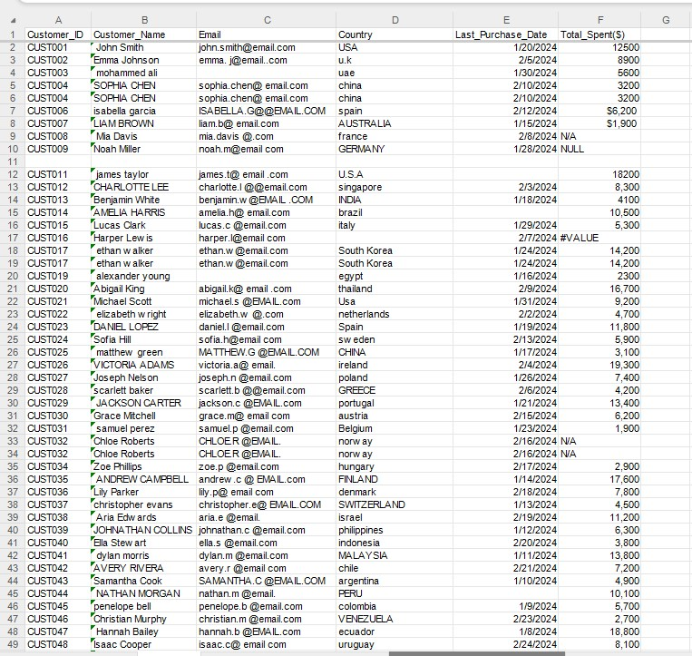

**Raw Data from row 50 to 80**

Screenshot:

---

### Data Cleaning Process 
The following cleaning steps are performed to clean the above raw data set to ensure data accuracy and consistency.

#### Removing Duplicate Rows 
Identified and removed 5 duplicate rows using Remove Duplicates.

Screenshot:
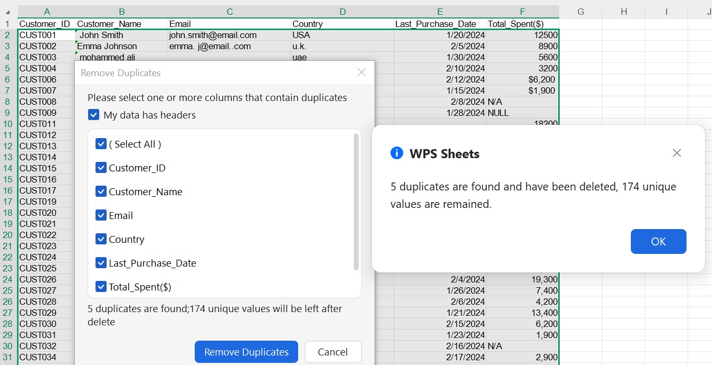

---

#### Removing Blank Rows 
Removed 3 blank rows using Filter.

**Before Removing Blank Rows**
Screenshot:
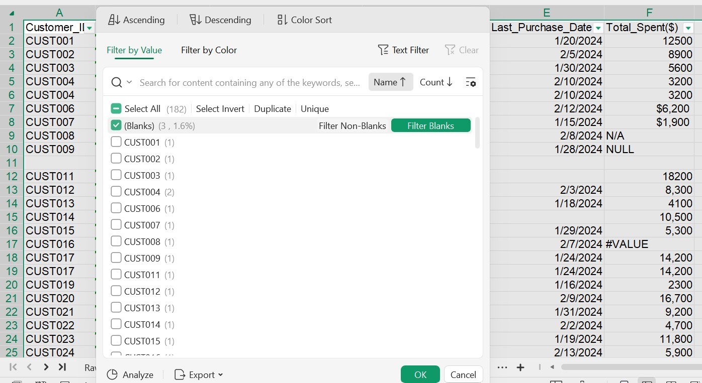

**After Removing Blank Rows**
Screenshot:
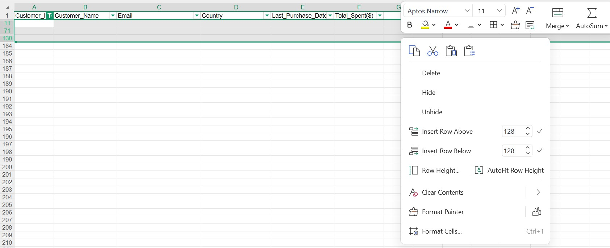

---

#### Standardizing Customer_Name 
Fixed inconsistent text casing and removed extra leading spaces in the Customer_Name column using Excel functions.

Used TRIM() to eliminate unnecessary leading and trailing spaces.

Applied PROPER() to standardize text formatting by capitalizing the first letter of each word in customer names.

Screenshot:

---

#### Email Column Cleaning and Standardization

##### Removing Extra Spaces and Special Character Errors 
The Email column contained several formatting issues, including unnecessary spaces, repeated symbols, and inconsistent letter casing. To resolve these issues, a nested formula combining SUBSTITUTE() and LOWER() functions was applied.

The innermost SUBSTITUTE() function removed any extra spaces within the email address.

The second SUBSTITUTE() replaced double at symbols (@@) with a single @.

The outermost SUBSTITUTE() corrected duplicate dots (..) by replacing them with a single dot (.).

Finally, the LOWER() function converted the entire cleaned email address to lowercase to ensure consistent formatting across the dataset.

This approach standardized the structure and improved the overall quality of the email data.

Screenshot:
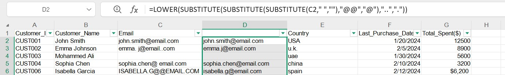

##### Correcting Domain Formatting Issues 
Some email addresses had incorrect or incomplete domain formats. These were corrected using FIND() and REPLACE() functions:

Replaced "emailcom" with "email.com".

Replaced "@.com" with "@email.com".

These corrections ensured that domain names followed a valid and consistent structure.

**Fixing "emailcom"**
Screenshot:
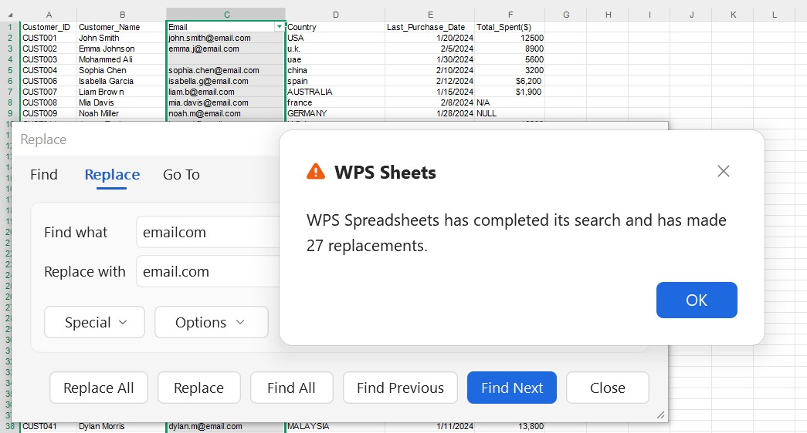

**Fixing "@.com"**
Screenshot:
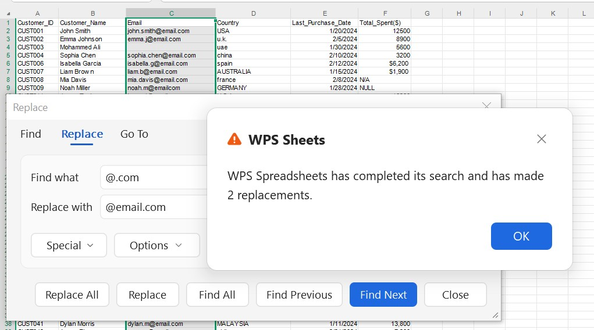

##### Fixing Missing “.com” Extensions 
Certain email entries ended with a period (.), indicating that the "com" extension was missing. To correct this, the following formula was used:

IF(RIGHT(C2,1)=".", C2&"com", C2)

This formula:

Checks whether the last character in cell C2 is a period.

If true, it appends "com" to the end of the email address.

If false, it leaves the original value unchanged.

Screenshot:

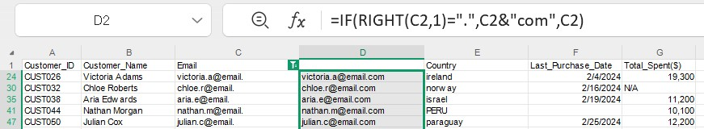

##### Handling Missing Email Values 
Some records contained blank email fields. To fix this, the following formula was applied:

IF(C2="", "No_Email_Provided", C2)

This formula:

Returns "No_Email_Provided" if the cell is empty.

Otherwise, it keeps the existing email address.

This step ensured that missing values were clearly identified instead of being left blank.

Screenshot:
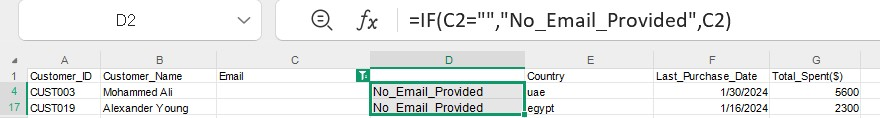

---

#### Country Column Cleaning

##### Standardizing Country Name Casing 
The Country column contained inconsistent capitalization. To standardize the full country names, the PROPER() function was applied to ensure that each word begins with a capital letter.

Screenshot:
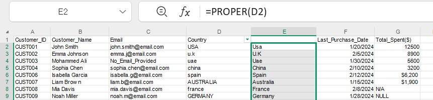

##### Correcting Abbreviated Country Names 
After applying the proper case formatting, some abbreviated country names were unintentionally altered (e.g., USA became Usa, and U.S.A became U.s.a). Since only a small number of records were affected, these entries were filtered and manually corrected to restore their accurate uppercase format (e.g., USA, UK).

**Before Cleaning**
Screenshot:
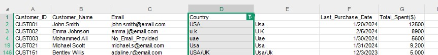

**After Cleaning**
Screenshot:
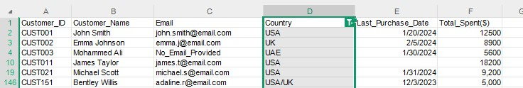

##### Handling Missing Country Values 
Replaced blank country values with "Unknown" using Find & Replace.

Screenshot:
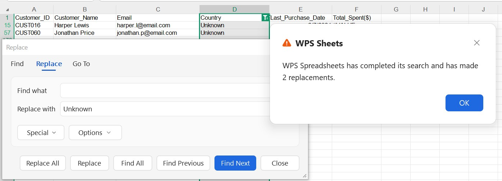

---

#### Last_Purchase_Date and Total_Spent Columns Cleaning

##### Date Column Standardization and Correction 
The Date column contained inconsistent date formats and one incorrectly entered value that was entered as 15-02-2024 instead of 02-15-2024 (MM-DD-YYYY format).Five dates were in a different text-based format: 5-MAR-24.The column had mixed date formats, which could affect sorting and analysis.

The entire Date column data type was converted to the standard MM-DD-YYYY format to ensure consistency.

The incorrectly entered date (15-02-2024) was manually corrected to 02-15-2024.

The text-formatted dates (e.g., 5-MAR-24) were automatically standardized after converting the column to proper date format.

All dates are now consistent in MM-DD-YYYY format.

The column is properly recognized as a Date data type.

**Before Cleaning**
Screenshot:
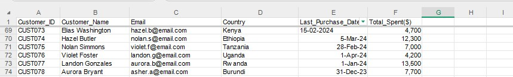

**During Cleaning**
Screenshot:
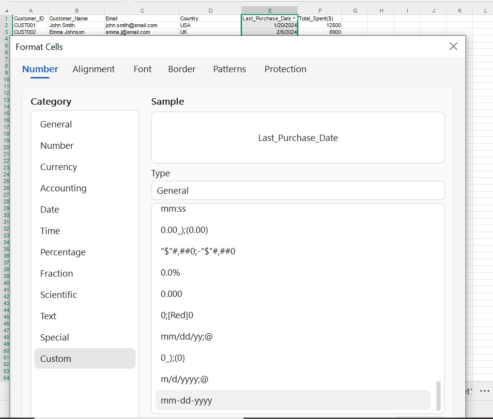

**After Cleaning**
Screenshot:
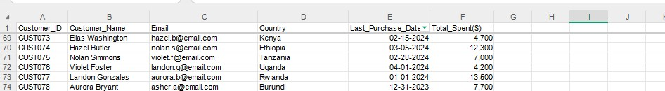

##### Standardizing Currency Values and Replacing Invalid Data from Total_Spent 
Removed $ symbols from Total Spent values, Converting invalid entries such as: N/A,NULL,#VALUE to blank values by using the formula shown in the formula bar of the screenshot below.
Screenshot:

Checks if G2 equals "N/A", "null”

If true => returns empty ""

Otherwise => converts G2 to a number using VALUE(G2)

If any error happens => returns ""

#####  Handling Missing Values

###### Flagging Missing Last_Purchase_Date 
Created a Data_Issue_Flag column that flags missing values in Last_Purchase_Date as "Missing_Purchase_Date" using formula =IF(AND(G2>0,E2=""),"Missing_Purchase_Date","OK")

This formula checks two conditions at the same time using AND

G2 > 0 => The value in cell G2 is greater than 0

E2 = "" => Cell E2 is empty (blank)

AND(G2>0, E2="") => Returns TRUE only if both conditions are true.

IF(logical_test, value_if_true, value_if_false)

If the AND condition is TRUE => returns "Missing_Purchase_Date"

If FALSE => returns "OK"
Screenshot:

###### Flagging Missing Total_Spent 
Created a Data_Quality_Flag column that flags missing values in Total_Spent as "Missing_Total_Spent" using formula =IF(AND(E2<>"",TRIM(G2)=""),"Missing_Total_Spent","OK")

E2<>"" => Checks if cell E2 is NOT empty.

TRIM(G2)="" => TRIM(G2) removes extra spaces from cell G2.Then it checks if the trimmed result is empty.This catches cases where G2 may look blank but actually contains spaces.

AND(E2<>"", TRIM(G2)="") => Both conditions must be TRUE.

IF(..., "Missing_Total_Spent", "OK")

If both conditions are TRUE => returns "Missing_Total_Spent", Otherwise => returns "OK"
Screenshot:
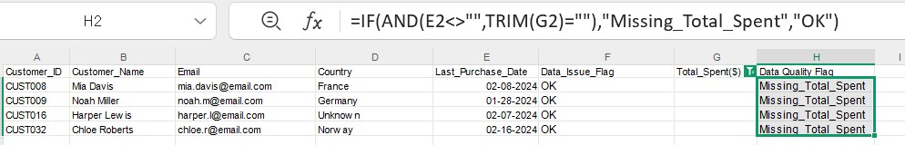

---

## Cleaned Dataset Description 
After completing the data cleaning process in Excel, the Clean Data set consists of 175 tows including header.The dataset is now standardized, consistent, and analysis-ready.The following improvements were achieved:

- Removed extra spaces and standardized casing in the Customer_Name.
- Cleaned and validated Email entries by fixing formatting errors, removing invalid characters, and handling missing values.
- Standardized capitalization and corrected abbreviated names in the Country.
- Converted the Last_Purchase_Date column into a consistent date format and resolved incorrect or missing entries.
- Removed currency symbols from Total_Spent, replaced invalid text values (N/A, NULL, Error), and handled missing data appropriately.

Additionally, two new columns were created to improve data quality monitoring:

- Date_Issue_Flag – Flags records where the Last_Purchase_Date value was missing.
- Data_Quality_Flag – Flags records where the Total_Spent value was missing.

The cleaned dataset is structured, validated, and ready for further analysis, reporting, or visualization.

### Note 
The four customers with no purchases were flagged as missing in cleaned data set due to N/A, NULL and #VALUE Total Spent entries in the raw dataset. 

**Clean Data from row 1 to 43**
Screenshot:
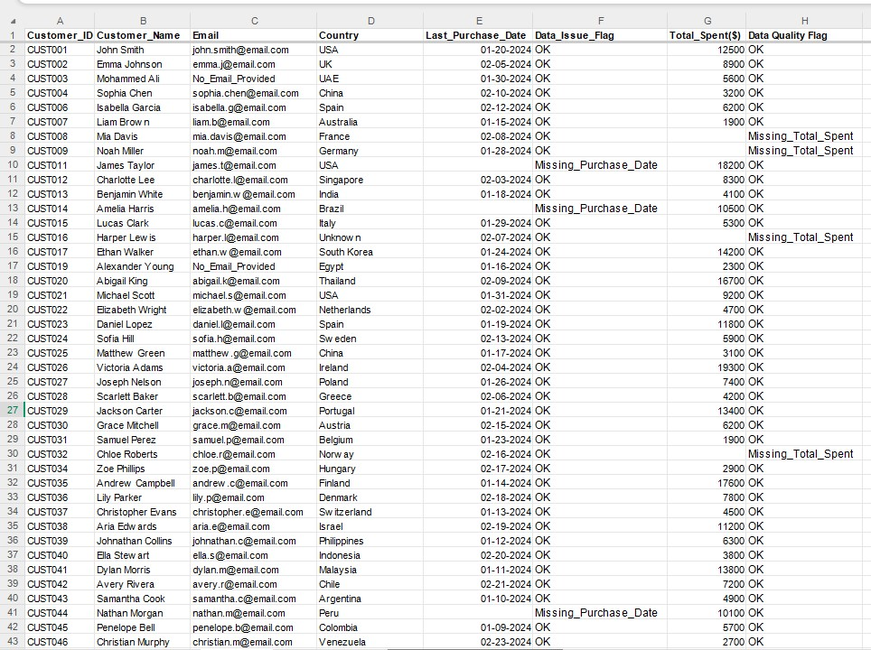

**Clean Data from row 44 to 75**
Screenshot
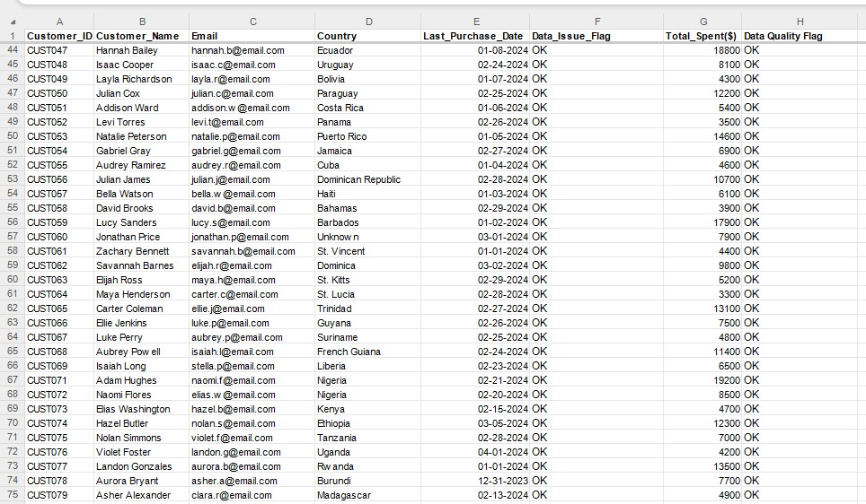

---

## Analysis 
After cleaning, the dataset was analyzed to answer the following business questions

### What is the total number of unique customers?

Determined the total number of customers using : COUNTA(Clean!B2:B175)

This formula gave me the total number of customers listed in column B (from row 2 to 175) of sheet Clean.

---

### How many  customers have made zero purchases ?

Identified customers with zero purchases using : COUNTBLANK(Clean!G2:G175)

Counts blank cells in column G of clean sheet. Assumes: if the cell is blank => customer made zero purchases.

---

### What percentage of customers made no purchase?

Calculated the percentage of customers with no purchases using : COUNTIF(Clean!G2:G175,"")/COUNTA(Clean2!B2:B175)

COUNTIF(Clean!G2:G175,"") => counts blank purchase cells.

COUNTA(Clean2!B2:B175) => counts total customers.

Dividing gives the percentage of customers with zero purchases.

---

### What is the overall total spending?

Calculated total spending using : SUM(Clean!G:G)

This formula calculates the total purchase amount by summing all values in column G of the Clean sheet, which contains the processed and validated transaction data.

---

### What is the average spend per customer?

Computed the average spend per customer using : AVERAGE(Clean!G2:G175)

AVERAGE computes the mean of numeric values.

Clean!G2:G175 references customer spend data in the Clean worksheet.

Blank and text cells are automatically ignored.

---

### Which country generate the highest revenue?

Identified the top revenue-generating country using : INDEX('Supporting Table 1'!B4:B115,MATCH(MAX('Supporting Table 1'!C4:C115),'Supporting Table 1'!C4:C115,0))

MAX('Supporting Table 1'!C4:C115) => Finds the highest value in column C of supporting table.

MATCH(..., 'Supporting Table 1'!C4:C115, 0) => Returns the position of that maximum value.

INDEX('Supporting Table 1'!B4:B115, …) => Retrieves the value from column B of supporting table at that same position.

**Formulas used in answering these business questions**
Screenshot:

---

### How is total spending distributed by country?

Calculated total spending distribution by country using formula shown in the formula bar in the following screenshot of Supporting Table 1 sheet
Screenshot:

Clean!D:D => The range containing the criteria values.

B4 => The specific criterion.

Clean!G:G => The range containing the values to be summed.

This formula calculates the total spending distributed by country in column G from the Clean sheet where the corresponding entries in column D match the criterion specified in cell B4.

---

### Which 25 countries contribute the highest total spending?

Showed top 25 countries by total spending using number filtering the Supporting Table 1

Filter => Number filter => Top 25

**Filtering Top 25 Countries By Total Spending**
Screenshot:

**Top 25 Countries By Total Spending**
Screenshot:

---

Analysis Screenshot:
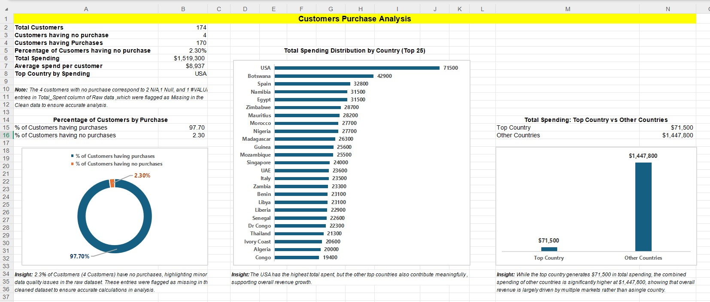

### Insights Generated
-2.3% of Customers (4 Customers) have no purchases, highlighting minor data quality issues in the raw dataset. These entries were flagged as missing in the cleaned dataset to ensure accurate calculations in analysis.
-While the top country generates $71,500 in total spending, the combined spending of other countries is significantly higher at around $1,447,800, showing that overall revenue is largely driven by multiple markets rather than a single country.
-The USA has the highest total spent, but the other top countries also contribute meaningfully , supporting overall revenue growth.

---

## 📊 Dashboard Creation: An excel dashboard was created to summarize insights visually.

The dashboard includes:
-KPIs
-Charts
-Chart level Insights

---

### Key Performance Indicators (KPIs): The following KPIs were displayed at the top of the dashboard to summarize overall performance:
-Total Customers 
-Number of Customers having  Purchase 
-Number of Customers having no Purchase
-Total Purchase 
-Top Country by Spending

---

### Charts

#### 1. Percentage of Customers by Purchase: This chart presents the percentage distribution of customers based on their purchase behavior — those who made at least one purchase versus those who made none.

#### 2. Total Spending_Top Country vs. Other Countries: This chart compares the total spending by the highest-performing country against the combined spending of all other countries.

#### 3. Total Spending Distribution by Country (Top 25): This chart visualizes and compares the total number of purchases made across the top 25 countries ranked by purchase volume.

---

### Chart Level Insights: Each chart is accompanied by a chart level insight displayed below it,summarizing the key takeaway from the analysis.
Dashboard Screenshot:

---

