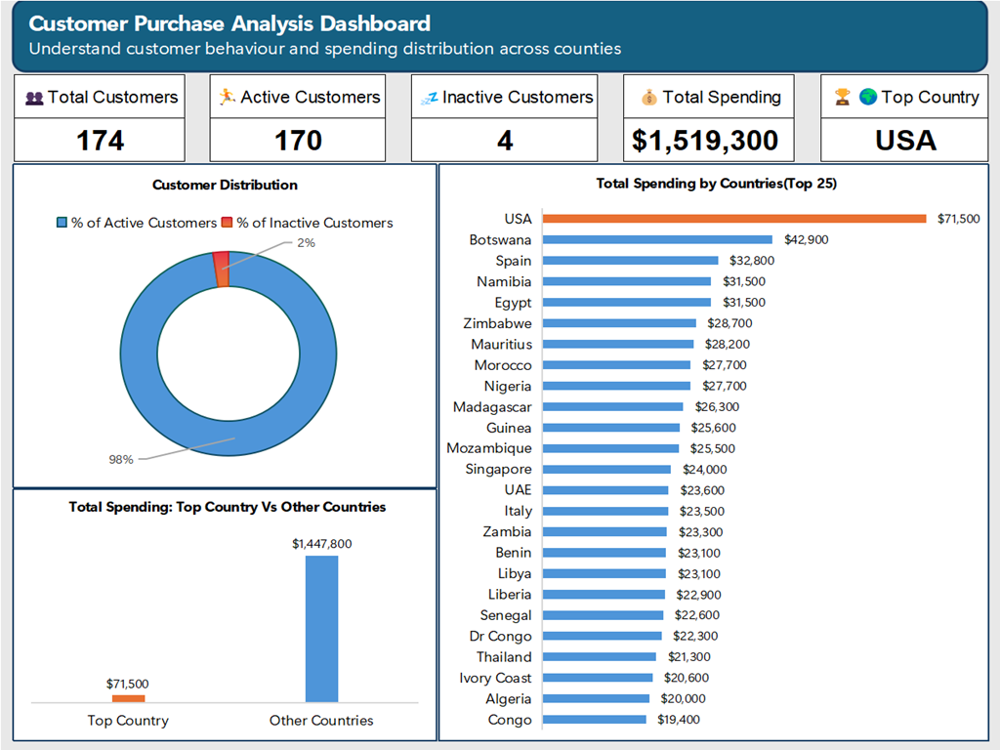

# Customer Data Cleaning and Purchase Analysis

## Project Overview 
This project is a customer analytics project that includes data cleaning, purchase analysis, and dashboard visualization using Excel. The goal is to analyze customer purchase behavior and extract meaningful insights.

---

## 🎯 Business Problem
 
*(Simulated scenario — the dataset is synthetic, generated for portfolio purposes, but the project is framed the way a real stakeholder request would be.)*
 
A business wants to understand its customer base: how many customers are actively purchasing, how much total revenue is being generated, and which markets (countries) are driving the most spending. Before any of that can be answered, the raw customer data has quality issues — inconsistent formatting, missing values, duplicates — that need to be resolved first.

---

## Project Objectives
1. Clean and standardize raw customer data using Excel formulas and tools
2. Calculate core KPIs (total customers, total spend, average spend, top country)
3. Analyze purchase distribution by country
4. Build a dashboard to visualize the results
5. Translate the findings into insights and recommendations

---

## Tools Used
- Excel
- Excel Ribbon Tools
- Excel Formulas & Functions
- Tables
- Charts
- Data Formatting

---
## 📁 Project Structure

```text
START ─────────────────────────────────────────────

Customer Data Cleaning & Purchase Analysis Dashboard/
│
├── Data/
│   ├── Raw/
│   │   ├── raw_1.jpg
│   │   └── raw_2.jpg
│   │
│   └── Cleaned/
│       ├── clean_1.jpg
│       └── clean_2.jpg
│
├── Cleaning/
│   └── Screenshots/
│       ├── Country/
│       │   ├── fixing_case_issues_in_country.jpg
│       │   ├── missing_country_names_fixed.jpg
│       │   ├── short_country_name_issues_fixed.jpg
│       │   └── short_country_names_issues.jpg
│       │
│       ├── Customer_Name/
│       │   └── fixing_case_issue_and_extra_spaces_in_cust-name.jpg
│       │
│       ├── Date/
│       │   ├── date_issue_fixed.jpg
│       │   ├── date_issues.jpg
│       │   ├── date_issues_fixing.jpg
│       │   └── date_missing_fixed.jpg
│       │
│       ├── Duplicate/
│       │   └── duplicates_removed.jpg
│       │
│       │──── blank/
│       │        ├── fixed_blank_rows.jpg
│       │        └── fixing_blank_rows.jpg
│       │
│       ├── Email/
│       │   ├── emailcom_fixed.jpg
│       │   ├── ends_with_._fixed.jpg
│       │   ├── fixing_@.com.jpg
│       │   ├── fixing_extra_spaces_@@_uppercase_in_email.jpg
│       │
│       └── Spent/
│           ├── total_spent_issue_1_fix.jpg
│           ├── total_spent_issue_2_fix.jpg
│           
├── Analysis/
│   ├── Analysis.jpg
│   └── Screenshots/
│       ├── kpi_formulas.jpg
│       ├── purchase_distribution_by_country_top_25_1.jpg
│       ├── purchase_distribution_by_country_top_25_2.jpg
│       └── spend_by_country.jpg
│
├── Dashboard/
│   └── Dashboard_Screenshot/
│       └── dashboard.jpg
│
└── README.md

END ─────────────────────────────────────────────
``` 

---

## Dataset Information
- **Source:** The data set used in this project was generated using DeepSeek AI(a generative artificial intelligence platform)  for portfolio purpose. All data is synthetic and does not represent real individuals.
- The raw data set has 183 rows including header row, duplicates rows and blank rows and the following six columns
Customer_ID

Customer_Name

Email

Country

Last_Purchase_Date

Total_Spent($)
- Type: Customer purchase records  

---

## Privacy Notice
- Due to privacy considerations,the complete Excel dataset is not publicly shared. Selected sample screenshots from raw dataset and supporting table are provided to demonstrate the cleaning and analysis workflow

---

## Data Cleaning 
This project focuses on cleaning and preparing raw data set using Excel.The raw dataset contained several inconsistencies and missing values, including:
- Extra spaces and inconsistent casing in Customer_Name
- Formatting errors, invalid characters, and missing values in Email
- Capitalization inconsistencies, issues in abbreviated names, and missing entries in Country
- Mixed formats, incorrect entry, and missing values in Date
- Currency symbols in some values, invalid text values (N/A, NULL, Error), and missing data in Total_Spent

---

**Raw data preview:**
 
| Rows | Screenshots |
|---|---|
| 1–49 | [View](Data/Raw/raw_1.jpg)
| 50–80 | [View](Data/Raw/raw_2.jpg)

---

### Data Cleaning Process 
The following cleaning steps are performed to clean the above raw data set to ensure data accuracy and consistency.

#### Removing Duplicate Rows 
Identified and removed 5 duplicate rows using Remove Duplicates.

**View Screenshot:**
 
<a href="Cleaning/Screenshots/Duplicate/duplicates_removed.jpg">Duplicate Removal</a>

---

#### Removing Blank Rows 
Removed 3 blank rows using Filter.

**View Screenshots:**
 
- Before: [Blank rows present](Cleaning/Screenshots/blank/fixing_blank_rows.jpg)
- After: [Blank rows removed](Cleaning/Screenshots/blank/fixed_blank_rows.jpg)

---

#### Standardizing Customer_Name 
Fixed inconsistent text casing and removed extra leading spaces in the Customer_Name column using Excel functions.

**Formula:**
```excel
=PROPER(TRIM(B2))
````

- `TRIM()` removes unnecessary leading/trailing spaces
- `PROPER()` capitalizes the first letter of each word

**View Screenshot:**
 
[Standardizing Text](Cleaning/Screenshots/Customer_Name/fixing_case_issue_and_extra_spaces_in_cust-name.jpg)

---

#### Email Column Cleaning and Standardization

**Removing extra spaces and special-character errors** 
The Email column contained several formatting issues, including unnecessary spaces, repeated symbols, and inconsistent letter casing. To resolve these issues, a nested formula combining SUBSTITUTE() and LOWER() functions was applied.

**Formula:**
```excel
=LOWER(SUBSTITUTE(SUBSTITUTE(SUBSTITUTE(C2," ",""),"@@","@"),"..","."))
````

- Innermost `SUBSTITUTE()` removes extra spaces
- Middle `SUBSTITUTE()` replaces `@@` with a single `@`
- Outer `SUBSTITUTE()` replaces `..` with a single `.`
- `LOWER()` standardizes casing

**View Screenshot:**
 
- [Fixing spaces, @@, .., and casing](Cleaning/Screenshots/Email/fixing_extra_spaces,@@,..,uppercase_in_email.jpg)

---

**Correcting domain formatting issues**
Some email addresses had incorrect or incomplete domain formats. These were corrected using FIND() and REPLACE() functions:

Replaced "emailcom" with "email.com".

Replaced "@.com" with "@email.com".

These corrections ensured that domain names followed a valid and consistent structure.

**View Screenshots:**

- [Fixing "emailcom"](Cleaning/Screenshots/Email/emailcom_fixed.jpg)
- [Fixing "@.com"](Cleaning/Screenshots/Email/fixing_@.com.jpg)

---

##### Fixing Missing “.com” Extensions 
Certain email entries ended with a period (.), indicating that the "com" extension was missing. To correct this, the following formula was used:

**Formula:**
```excel
=IF(RIGHT(C2,1)=".", C2&"com", C2)
````

This formula:

Checks whether the last character in cell C2 is a period.

If true, it appends "com" to the end of the email address.

If false, it leaves the original value unchanged.

**View Screenshot:**

[Fixing Missing "com"](Cleaning/Screenshots/Email/ends_with_._fixed.jpg)

---

##### Handling Missing Email Values 
Some records contained blank email fields. To fix this, the following formula was applied:

**Formula:**
```excel
=IF(C2="", "No_Email_Provided", C2)
````

This formula:

Returns "No_Email_Provided" if the cell is empty.

Otherwise, it keeps the existing email address.

This step ensured that missing values were clearly identified instead of being left blank.

**View Screenshot:**

[Handling Missing Email](Cleaning/Screenshots/Email/no_email_fixed.jpg)

---

#### Country Column Cleaning

**Standardizing Country Name Casing**
The Country column contained inconsistent capitalization. To standardize the full country names, the PROPER() function was applied to ensure that each word begins with a capital letter.

**Formula:**
```excel
=PROPER(D2)
````

**View Screenshot:**

[Fixing casing issues](Cleaning/Screenshots/Country/fixing_case_issues_in_country.jpg)

---

**Correcting abbreviated names**
 
`PROPER()` unintentionally altered abbreviations (e.g. `USA` → `Usa`, `U.S.A` → `U.s.a`). Since only a small number of records were affected, these were filtered and manually corrected back to `USA`, `UK`, etc.

**View Screenshots:**

- [Before Correction](Cleaning/Screenshots/Country/short_country_names_issues.jpg)
- [After Correction](Cleaning/Screenshots/Country/short_country_name_issues_fixed.jpg)

---

**Handling Missing Country Values** 
Replaced blank country values with "Unknown" using Find & Replace.

**View Screenshot:**

[Handling Missing Country](Cleaning/Screenshots/Country/missing_country_names_fixed.jpg)

---

#### Last_Purchase_Date and Total_Spent Columns Cleaning

**Date Column Standardization and Correction** 
The `Last_Purchase_Date` column had mixed formats: one value entered as `15-02-2024` instead of `02-15-2024` (MM-DD-YYYY), and five dates in a text format like `5-MAR-24`. The column was converted to a consistent date type, and the miskeyed date was corrected manually.

**View Screenshots:**

- [Before Cleaning](Cleaning/Screenshots/Date/date_issues.jpg)
- [During Cleaning](Cleaning/Screenshots/Date/date_issues_fixing.jpg)
- [After Cleaning](Cleaning/Screenshots/Date/date_issue_fixed.jpg)

---

**Standardizing Currency Values and Replacing Invalid Data from Total_Spent** 
Removed $ symbols from Total Spent values, Converting invalid entries such as: N/A,NULL,#VALUE to blank values by using the formula

**Formula:**
```excel
=IFERROR(IF(OR(F6="N/A",F6="NULL"),"",VALUE(F6)),"")
````
Checks if G2 equals "N/A", "null”

If true => returns empty ""

Otherwise => converts G2 to a number using VALUE(G2)

If any error happens => returns blank cell

**View Screenshot:**

[Standardizing_Currency_Values_and_Replacing_Invalid_Data](Cleaning/Screenshots/Spent/total_spent_issue_1_fix.jpg)

---

**Flagging Missing Last_Purchase_Date**

Created a Data_Issue_Flag column that flags missing values in Last_Purchase_Date as "Missing_Purchase_Date" using formula 

**Formula:**
```excel
=IF(AND(G2>0,E2=""),"Missing_Purchase_Date","OK")
````

This formula checks two conditions at the same time using AND

G2 > 0 => The value in cell G2 is greater than 0

E2 = "" => Cell E2 is empty (blank)

AND(G2>0, E2="") => Returns TRUE only if both conditions are true.

IF(logical_test, value_if_true, value_if_false)

If the AND condition is TRUE => returns "Missing_Purchase_Date"

If FALSE => returns "OK"

**View Screenshot:**

[Flagging_Missing_Dates](Cleaning/Screenshots/Date/date_missing_fixed.jpg)

---

**Flagging Missing Total_Spent**

Created a Data_Quality_Flag column that flags missing values in Total_Spent as "Missing_Total_Spent" using formula 

**Formula:**
```excel
=IF(AND(E2<>"",TRIM(G2)=""),"Missing_Total_Spent","OK")
````

E2<>"" => Checks if cell E2 is NOT empty.

TRIM(G2)="" => TRIM(G2) removes extra spaces from cell G2.Then it checks if the trimmed result is empty.This catches cases where G2 may look blank but actually contains spaces.

AND(E2<>"", TRIM(G2)="") => Both conditions must be TRUE.

IF(..., "Missing_Total_Spent", "OK")

If both conditions are TRUE => returns "Missing_Total_Spent", Otherwise => returns "OK"

**View Screenshot:**

[Flagging_Missing_Spent](Cleaning/Screenshots/Spent/total_spent_issue_2_fix.jpg)

---

## Cleaned Dataset Description 
After cleaning, the dataset has **175 rows** (including header), standardized and analysis-ready:
 
- Removed extra spaces and standardized casing in `Customer_Name`
- Cleaned and validated `Email` entries
- Standardized capitalization and corrected abbreviations in `Country`
- Converted `Last_Purchase_Date` into a consistent date format
- Removed currency symbols and invalid text from `Total_Spent`
Two new columns were added for data quality monitoring:
- `Date_Issue_Flag` — flags missing `Last_Purchase_Date`
- `Data_Quality_Flag` — flags missing `Total_Spent`
**Note:** 4 customers with no purchases were flagged as missing due to `N/A`, `NULL`, and `#VALUE` entries in the raw `Total_Spent` column.

**Cleaned data preview:**
 
| Rows | Screenshot |
|---|---|
| 1–43 | [View](Data/Cleaned/clean_1.jpg)
| 44–75 | [View](Data/Cleaned/clean_2.jpg)

---

## Analysis 
After cleaning, the dataset was analyzed to answer the following business questions

### Business Questions & Formulas
 
| # | Question | Formula | Result |
|---|---|---|---|
| 1 | Total unique customers | `=COUNTA(Clean!B2:B175)` | _174_ |
| 2 | Customers with zero purchases | `=COUNTBLANK(Clean!G2:G175)` | _04_ |
| 3 | % of customers with no purchase | `= COUNTIF(Clean!G2:G175,"")/COUNTA(Clean2!B2:B175)` | _2.3_ |
| 4 | Overall total spending | `=SUM(Clean!G:G)` | _$ 1519300_ |
| 5 | Average spend per customer | `=AVERAGE(Clean!G2:G175)` | _$ 8937_ |
| 6 | Top revenue-generating country | `= INDEX('Supporting Table 1'!B4:B115,MATCH(MAX('Supporting Table 1'!C4:C115),'Supporting Table 1'!C4:C115,0))` | _USA_ |

*`'Supporting Table 1'` is a helper table listing each country alongside its total spend, built to make the INDEX/MATCH lookup possible.*

### How is total spending distributed by country?

Calculated total spending distribution by country using formula 

**Formula:**
```excel
= SUMIF(Clean!D:D,B4,Clean!G:G)
````
Sums `Total_Spent` (column G) for rows where `Country` (column D) matches the criterion in `B4`.

**View Screenshot:**

[spending_distribution_by_country ](Analysis/Screenshots/spend_by_country.jpg)

---

### Which 25 countries contribute the highest total spending?

Filtered the supporting table using **Filter → Number Filter → Top 25**.

**View Screenshots:**
 
- [Filtering top 25](Analysis/Screenshots/purchase_distribution_by_country_top_25_1.jpg)
- [Top 25 result](Analysis/Screenshots/purchase_distribution_by_country_top_25_2.jpg)

---

### Insights Generated
- **2.3% of customers (4 customers)** have no purchases, highlighting minor data quality issues in the raw dataset — flagged in the cleaned dataset to keep calculations accurate
- The top country generates **$71,500** in total spending, while the combined spending of all other countries is significantly higher at **~$1,447,800** — revenue is driven by many markets, not one
- The **USA** has the highest total spend, but other top countries also contribute meaningfully to overall revenue

---

## 💡 Recommendations
 
1. **Follow up with the 4 flagged no-purchase customers** to understand why — is it a data entry issue, or did they genuinely never convert?
2. **Don't over-index on the top country** — since revenue is spread across many markets rather than concentrated in one, retention efforts should stay broad rather than assuming the top country alone drives growth
3. **Investigate the top 25 countries individually** to see if there's a natural tier (e.g. top 5 vs the rest) that deserves different marketing treatment
---

## 📊 Dashboard Creation: An excel dashboard was created to summarize insights visually.

An Excel dashboard was created to summarize insights visually.
 
**KPIs displayed:**
- Total Customers
- Number of Customers with a Purchase
- Number of Customers with No Purchase
- Total Purchase
- Top Country by Spending
**Charts:**
 
| Chart | Purpose |
|---|---|
| Customer Distribution | % of customers who purchased vs. made no purchase |
| Total Spending — Top Country vs. Other Countries | Compares the top-performing country's spend against the combined total of all others |
| Total Spending Distribution by Country (Top 25) | Compares total spend across the top 25 countries |

**View Screenshot**



---

## 👤 Author

Yasir Shah | Data Analyst | SQL | Power BI | Excel

- www.linkedin.com/in/yasir-shah-2364183b3
- https://github.com/yasirshah-analyst
- shahyasir443@gmail.com

---

